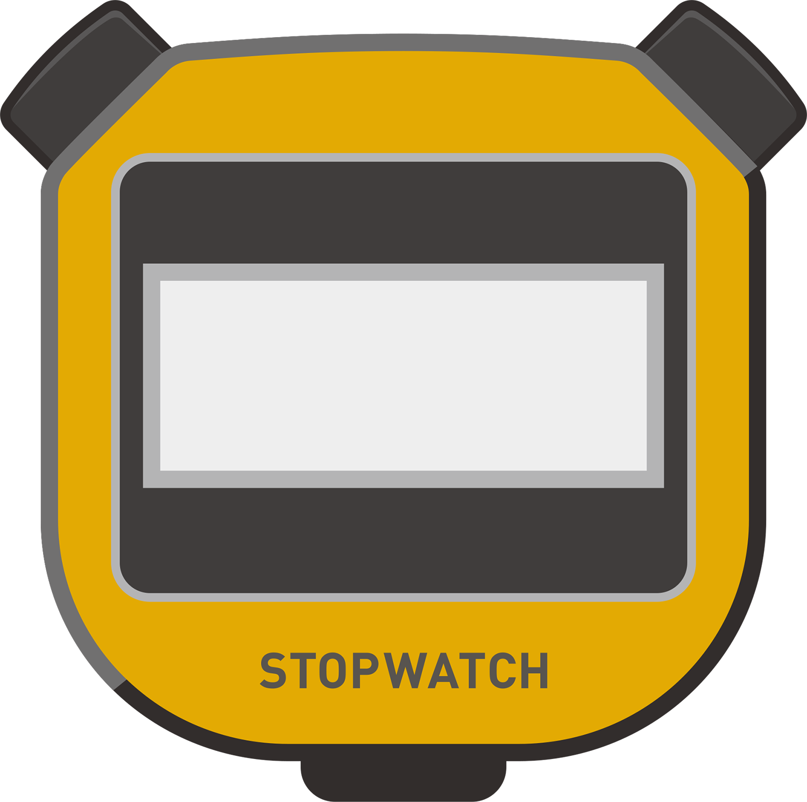

# stopwatch

**デモはこちら:** [https://ryota0610.github.io/stopwatch/](https://ryota0610.github.io/stopwatch/)

<!-- ▼ スクリーンショット ▼ -->
<!-- TODO: ここにスクリーンショットを追加してください。推奨横幅: 600px〜800px程度 -->
<!--  -->

## 概要

HTMLでストップウォッチの背景画像を配置し、TypeScriptの学習を目的としてストップウォッチ機能を追加したWebアプリケーションです。
([図解！ TypeScriptのツボとコツがゼッタイにわかる本 “超”入門編](https://www.shuwasystem.co.jp/book/9784798067324.html) を参考に作成しました。)

## 主な機能

*   **計測:**
    *   時間のカウントを開始/一時停止/再開できます。
    *   計測をリセットしてゼロから開始できます。
*   **表示:**
    *   時間を「分 : 秒 ミリ秒 (1/100秒単位)」の形式 (`MM : SS FF`) で表示します。
    *   最大 `59 : 59 99` まで表示可能です。
*   **操作:**
    *   右ボタンで「開始」「一時停止」「再開」を制御します。
    *   左ボタンで計測を「リセット」します。

## 必要条件・動作環境

**実行環境:**

*   モダンなWebブラウザ (Chrome, Firefox, Safari, Edgeなど)

**開発環境:**

*   [Node.js](https://nodejs.org/) (特定のバージョン指定はありませんが、最新のLTS版を推奨します)
*   [npm](https://www.npmjs.com/) (Node.jsに付属)
*   TypeScript Compiler (`tsc`) (npm経由でインストールされます)

## ファイル構成

stopwatch/
├── docs/ # 開発用ソースファイル & GitHub Pages公開用ディレクトリ
│ ├── index.html
│ ├── index.css
│ ├── index.ts # TypeScriptソース
│ ├── index.js # (tscによって生成されるJavaScript)
│ └── stopwatch.png # 背景画像
├── release/ # 完成版参照用コード (本書の解答コード)
│ ├── index.html
│ ├── index.css
│ ├── index.js
│ ├── index.ts
│ └── stopwatch.png
├── .gitignore
├── package.json # npm パッケージ設定
├── tsconfig.json # TypeScript コンパイラ設定
├── vercel.json # (Vercel用設定ファイル - 現在はGitHub Pagesを使用)
└── README.md

## インストール・セットアップ

ローカル環境でこのストップウォッチを動かし、開発するには以下の手順が必要です。

1.  リポジトリをクローンします:
    ```bash
    git clone https://github.com/RYOTA0610/stopwatch.git
    cd stopwatch
    ```
2.  開発に必要なパッケージをインストールします:
    ```bash
    npm install
    ```
3.  TypeScriptコードをJavaScriptにコンパイルします:
    ```bash
    npm run build
    ```
    これにより、`docs`フォルダ内に`index.js`ファイルが生成（または更新）されます。
4.  `docs/index.html` ファイルをお使いのWebブラウザで開きます。

## 使い方

1.  **デモページを開く:** [https://ryota0610.github.io/stopwatch/](https://ryota0610.github.io/stopwatch/) にアクセスするか、上記「インストール・セットアップ」の手順でローカルで `docs/index.html` を開きます。
2.  ストップウォッチが表示されます。
3.  **計測を開始する:** 画面右側のボタンをクリックします。
4.  **計測を一時停止する:** 再度、右側のボタンをクリックします。
5.  **計測を再開する:** さらに右側のボタンをクリックします。
6.  **計測をリセットする:** 画面左側のボタンをクリックすると、時間表示が `00 : 00 00` に戻り、カウントが停止します。

## 技術スタック

*   HTML
*   CSS
*   TypeScript

## 貢献方法

コードの改善提案やバグ報告を歓迎します！

*   **バグ報告・機能要望:** GitHubリポジトリの **[Issues](https://github.com/RYOTA0610/stopwatch/issues)** に投稿してください。
*   **コードの改善提案 (Pull Request):**
    1.  このリポジトリ ( `https://github.com/RYOTA0610/stopwatch` ) を **Fork** します。
    2.  改善内容のための新しい **Branch** を作成します (`git checkout -b feature/your-improvement`)。
    3.  コードを修正・改善し、変更内容を **Commit** します (`git commit -m 'Improve something'`)。
    4.  作成したブランチを自分のForkしたリポジトリに **Push** します (`git push origin feature/your-improvement`)。
    5.  元のリポジトリ ( `RYOTA0610/stopwatch` ) に対して **Pull Request** を作成し、変更内容を説明してください。

## ライセンス

**注意:** このプロジェクトは、書籍「図解！ TypeScriptのツボとコツがゼッタイにわかる本 “超”入門編」に掲載されているコードをベースに作成・改造されています。

元の書籍にライセンスに関する明確な記述が見当たらなかったため、**このリポジトリのコードを利用する際は、元の書籍の著作権にご注意ください。**

もしご自身で作成したコード部分についてライセンスを設定したい場合は、元のコードの著作権との関係を考慮の上、慎重にご判断ください。不明な場合は、ライセンスを明記しないのが無難かもしれません。

## 作者・連絡先

*   **RYOTA0610**
*   GitHub: [@RYOTA0610](https://github.com/RYOTA0610)

## FAQ (よくある質問)

*   **Q: カウントが正確でない場合があります。**
    *   A: ブラウザのJavaScriptタイマー (`setInterval` や `setTimeout`) の精度には限界があり、特にPCやブラウザが高負荷状態の場合、ミリ秒単位でのズレが生じることがあります。これはWeb技術の一般的な制約によるものです。
*   **Q: スマートフォンでボタンを押してから反応するまでに少し時間がかかることがあります。**
    *   A: スマートフォン、特に性能が高くない機種では、タッチイベントの処理や画面の再描画にPCよりも時間がかかる場合があります。また、コード内のイベント処理や描画処理の負荷が高い場合もラグの原因となりえます。

## 今後の計画

*   **時計モードの追加:**
    *   リセットボタン (左ボタン) をダブルクリックすることで、ストップウォッチモードと時計モードを切り替えられるようにします。
    *   時計モードでは、現在時刻を1秒ごとに更新して表示します。

## 謝辞

*   **書籍:** 図解！ TypeScriptのツボとコツがゼッタイにわかる本 “超”入門編 (中田 亨 著, 秀和システム)
    *   本書のサンプルコードをベースに学習・開発を行いました。
